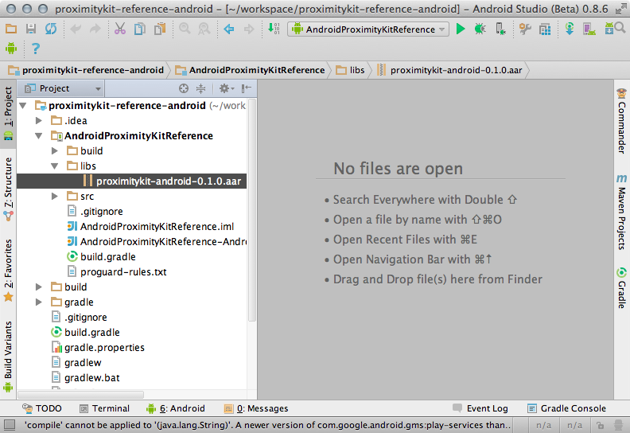
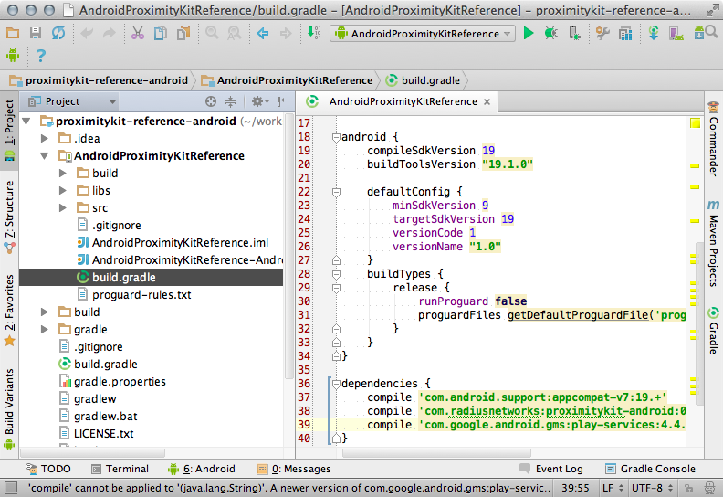

# Download the Proximity Kit iOS SDK

By downloading any content you agree to abide by the terms of the [license](license).

## Instructions for Android Studio

Known working with Android Studio 0.5.2+ and Gradle 1.12

### 1. Download and Include the Library

Download and extract proximitykit-android.aar:

<a class="btn" href="https://github.com/RadiusNetworks/proximitykit-android/releases/latest"> Download Proximity Kit Library AAR</a>

Create a `/libs` directory inside your project and copy the AAR file there.



### 2. Configure your Android Studio Project

Android Studio 0.5.2+ has `.aar` file support. However, there is an [issue with Gradle](https://code.google.com/p/android/issues/detail?id=55863) not recognizing local `.aar` dependencies. Dependencies pulled from Maven work just fine.

Working around the issue is simple:

Add a `flatDir` entry to the repositories section of the `build.gradle` file.

Newer Android Studio projects have two build.gradle files. This change should go in `MyAppRoot/build.gradle` under the allprojects section:

```
allprojects {
    repositories {
        mavenCentral()
        flatDir {
            dirs 'libs'
        }
    }
}
```

Add a new dependency for the Proximity Kit library to your app module's build.gradle file:

```
dependencies {
    compile 'com.android.support:appcompat-v7:19.+'
    compile 'com.radiusnetworks:proximitykit-android:0.+@aar'
}
```

Again, newer projects have two `build.gradle` files. This change needs to be added to the one for your main app module: `MyAppRoot/appmodule/build.gradle`

See the [reference app's](https://github.com/RadiusNetworks/proximitykit-reference-android/) `build.gradle` file for a full example.



If Android Studio does not resolve the Java classes in the library immediately after setup, please close and re-open your Android Studio project.

For more details see our [getting started guide](getting_started).

### Set the Token and URL

TODO: Example Code

# Add Geofence Support

The steps below are provided as a convenience. They were written using Google Play services version 4.4.x and Gradle version 1.12. We strongly urge you to consult the latest [Google documentation](https://developer.android.com/google/play-services/setup.html) for up-to-date instructions.

To make the Google Play services APIs available to your app:

## 1. Open the `build.gradle` file inside your application module directory.

> Note: Android Studio projects contain a top-level build.gradle file and a build.gradle file for each module. Be sure to edit the file for your application module. See Your Project with Gradler for more information about Gradle.

## 2. Add a new build rule under `dependencies` for the latest version of `play-services`. For example:

```
apply plugin: 'android'
...


dependencies {
    compile 'com.android.support:appcompat-v7:19.+'
    compile 'com.google.android.gms:play-services:4.4+'
}
```
Be sure you update this version number each time Google Play services is updated.

## 3. Save the changes and click Sync Project with Gradle Files in the toolbar.

Open your app's manifest file and add the following tag as a child of the<application> element:

```
<meta-data android:name="com.google.android.gms.version"
           android:value="@integer/google_play_services_version" />
```

# Configuring Geofences

Geofence support is disabled by default. In order to utilize geofences from the Android OS, the Google Play services library needs to be installed with the app. Additionally, an appropriate version of Google Play services needs to be available on the mobile device.

The steps involved in configuring Google Play services vary depending on the version of Google Play services you plan on using, as well as, your choice of development environment. We strongly urge you to consult [Google's documentation](https://developer.android.com/google/play-services/setup.html) on how to appropriately configure your specific environment.

The steps below are provided as a convenience. They were written using Google Play services version 4.4.x and Gradle version 1.12. Be sure to consult your version's Google documentation for up-to-date instructions.

### 1. Include Google Play services dependency

Be sure that you've already properly configured Google Play services for either your Eclipse or Android Studio project.

### 2. Set Permissions

Declare that the app needs to request `ACCESS_FINE_LOCATION`. To request this permission, add the following element as a child element of the `<manifest>` element:

```
<uses-permission android:name="android.permission.ACCESS_FINE_LOCATION"/>
```

### 3. Verify Google Play Services Support

Check for Google Play support. For the most recent suggestions by Google, please refer to the [Android documentation on checking for Google Play services support](https://developer.android.com/google/play-services/setup.html#ensure).

> Because each app uses Google Play services differently, it's up to you [the app developer] decide the appropriate place in your app to check verify the Google Play services version. For example, if Google Play services is required for your app at all times, you might want to do it when your app first launches. On the other hand, if Google Play services is an optional part of your app, you can check the version only once the user navigates to that portion of your app.
>
> To verify the Google Play services version, call `isGooglePlayServicesAvailable()`. If the result code is `SUCCESS`, then the Google Play services APK is up-to-date and you can continue to make a connection. If, however, the result code is `SERVICE_MISSING`, `SERVICE_VERSION_UPDATE_REQUIRED`, or `SERVICE_DISABLED`, then the user needs to install an update. So, call `GooglePlayServicesUtil.getErrorDialog()` and pass it the result error code. This returns a Dialog you should show, which provides an appropriate message about the error and provides an action that takes the user to Google Play Store to install the update.

Calling `isGooglePlayServicesAvailable` is something your app should do after it has started, but before you attempt to call `ProximityKitManager#enableGeofences()`. If Google Play services is not available, it is likely you will want to take some form of action, such as interacting with the user. Due to this, Proximity Kit does not provide any recommendations or best practices for how this should be done.

We suggest consulting the Google Play services geofence sample code for more ideas on how to perform these checks.

The sample code below is taken from the Proximity Kit Android Reference App. This provides another idea for how an app can check for Google Play services on a device. This sample includes showing a notification to the app's user directing them to take appropriate action:

```java
/**
 * Verify that Google Play services is available before making a request.
 *
 * @return true if Google Play services is available, otherwise false
 */
private boolean servicesConnected() {
    // Check that Google Play services is available
    int resultCode =
            GooglePlayServicesUtil.isGooglePlayServicesAvailable(this);

    // If Google Play services is available
    // If Google Play services is available
    if (ConnectionResult.SUCCESS == resultCode) {
        // In debug mode, log the status
        Log.d(TAG, "Google Play services available");
        return true;
    // Google Play services was not available for some reason
    } else {
        // Display an error dialog
        Dialog dialog = GooglePlayServicesUtil.getErrorDialog(resultCode, this, 0);
        if (dialog != null) {
            ErrorDialogFragment errorFragment = new ErrorDialogFragment();
            errorFragment.setDialog(dialog);
            errorFragment.show(getSupportFragmentManager(), TAG);
        }
        return false;
    }
}

/**
 * Define a DialogFragment to display the error dialog generated in
 * showErrorDialog.
 */
public static class ErrorDialogFragment extends DialogFragment {
    // Global field to contain the error dialog
    private Dialog mDialog;

    /**
     * Default constructor. Sets the dialog field to null
     */
    public ErrorDialogFragment() {
        super();
        mDialog = null;
    }

    /**
     * Set the dialog to display
     *
     * @param dialog An error dialog
     */
    public void setDialog(Dialog dialog) {
        mDialog = dialog;
    }

    /*
     * This method must return a Dialog to the DialogFragment.
     */
    @Override
    public Dialog onCreateDialog(Bundle savedInstanceState) {
        return mDialog;
    }
}
```

## Enable Geofences in Proximity Kit

Enable geofences in the Proximity Kit API, after, and only after, your app has verified that Google Play services is available:

```java
/*
 * It is our job (the app) to ensure that Google Play services is available. If it is not
 * then attempting to enable geofences in Proximity Kit will fail, throwing a
 * GooglePlayServicesException. This will happen in the following conditions:
 *
 * - We forget to include Google Play services as a dependency of our applicaiton
 * - The device the app is running on does not have Google Play services
 * - The device the app is running on has an outdated version of Google Play services
 *
 * It is our responsibility to handle this, as we (the app), are the only one in a position
 * to decide how to behave if this service is not available.
 *
 * In this example, we've decided to check to make sure the service is available. In the
 * event we think the service is available, but enabling geofences still fails, we log the
 * error and continue without geofences.
 *
 * See servicesConnected for how we handle the cases where the device doesn't have Google
 * Play services, or the version is out of date.
 */
if (servicesConnected()) {
    // As a safety mechanism, `enableGeofences()` throws a checked exception in case the
    // app does not properly handle Google Play support.
    try {
        pkManager.enableGeofences();
        pkManager.setProximityKitGeofenceNotifier(this);
    } catch (GooglePlayServicesException e) {
        Log.e(TAG, e.getMessage());
    }
}
```
