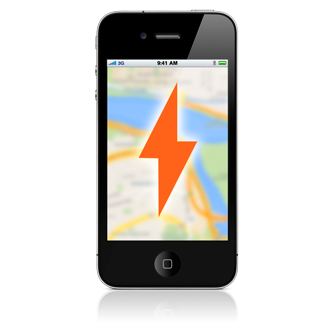

# Proximity Kit Documentation

Designed to help developers build location aware apps. By providing a rich SDK built on top of the latest Geofence and Beacon technology, Proximity Kit gives you the events you need to keep your app relevant and useful to your users.

## The Lifecycle of a Proximity Kit

  

    
    <h3>1. Configure Geofences and Beacons in the Web Portal</h3>
    
Configure and manage your Geofences and Beacons in our simple web portal. This is where you setup your kit, normally one kit per app, and set the region attributes.

  

  

    
    <h3> 2. Mobile SDK Syncs with Mobile Device </h3>
    
 When the app starts up the Proximity Kit Manager, it will sync with our backend. As that happens the SDK will register each region to monitor. Your region data and configuration is cached and can be updated in the background.

  

  

    
    <h3> 3. Device Monitors for Proximity Events </h3>
    
 When your app is in the background, we'll monitor for proximity events, even after the user restarts their phone. When your app is in the foreground, Proximity Kit will provide detailed information about the Beacons or GPS coordinates around it.

  

Upon entering or leaving an Beacon or Geofence region, Proximity Kit notifies your app of the proximity event along with region identifiers and associated metadata. While in an Beacon region, Proximity Kit provides additional ranging services for continuous proximity updates relative to the phone's distance from the Beacon.

---

## Beacon Hardware

While Proximity Kit will work with beacons that implment iBeacon™ Technology or that follow the [AltBeacon Standard](http://altbeacon.org/). This is subject to mobile device operating system and hardware support.

Of course we do build our own beacons and beleive they are the best beacon hardware out there. That is avaliable in the [Radius Networks Store](http://store.radiusnetworks.com/)

There are also software alternatives to boradcasting as a beacon, a few of our apps include [Locate for iOS](https://itunes.apple.com/us/app/locate-beacon/id738709014?mt=8), [QuickBeacon](http://store.radiusnetworks.com/collections/software/products/quickbeacon) and [MacBeacon](http://store.radiusnetworks.com/collections/all/products/macbeacon).

---

## Android Resources

The Proximity Kit Android Library is the same as the Android Pro Library. It is built upon our open source [Android Beacon Library](https://github.com/AltBeacon/android-beacon-library), and all the documentation that applies to those libraries is relevant to working with Proximity Kit.

### Download the SDK

<a class="btn" href="http://proximitykit.com/android-download">Android SDK Download and Install</a>

Users of the Proximity Kit client library agree to abide by the license terms as specified for <a href="android/license">Android</a>.

## Additional Resources

<a class="btn" href="/ibeacon/android/samples.html">Sample Code</a> <a class="btn" href="/ibeacon/android/pro/documentation.html">Documentation</a>

---

## iOS Resources

The iOS Proximity Kit SDK is built upon Apple's CoreLocation, extending the functionality and web management.

### Download the SDK

<a class="btn" href="http://proximitykit.com/download">iOS SDK Download and Install</a>

Users of the Proximity Kit client library agree to abide by the license terms as specified for [iOS](ios/license).

### Additional Resources

<a class="btn" href="gettingstarted">Getting Started</a> <a class="btn" href="ios/webbeacon">10 Minute Tutorial</a> <a class="btn" href="ios/docs">SDK Reference</a>

<a class="btn" href="https://github.com/RadiusNetworks/proximity-kit-ios-example">iOS Reference App</a> <a class="btn" href="ios/tracking-beacons.html">Tracking Beacons Example</a>

---

## Still need a hand?

If you have any other questions feel free to drop us a [note](mailto:support@radiusnetworks.com).

