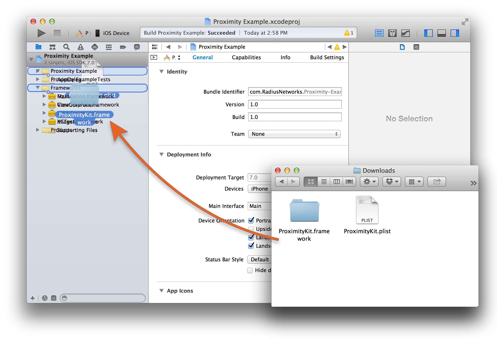
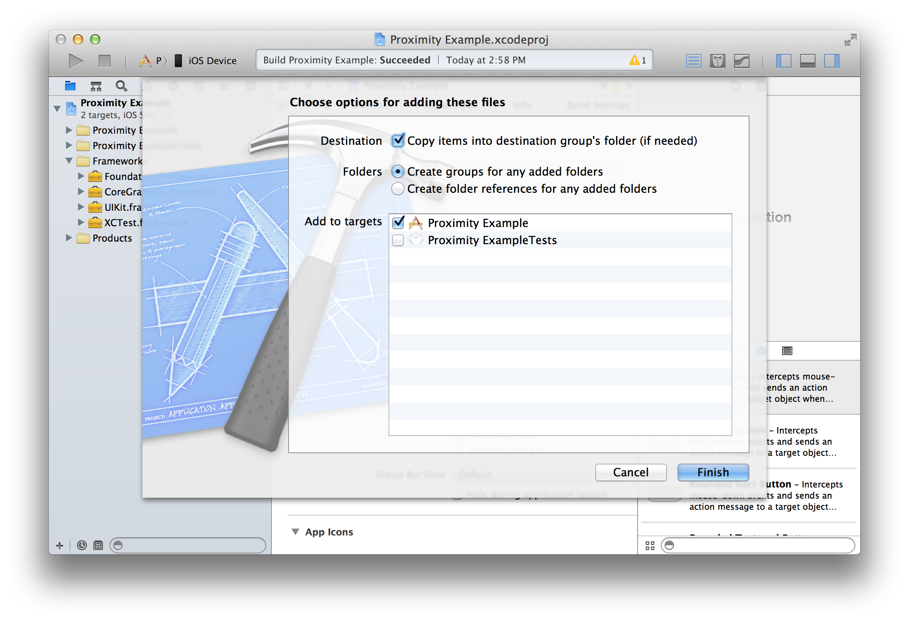

# Download the Proximity Kit iOS SDK

## Get the Framework


By downloading any content you agree to abide by the terms of the [license](license)

## Manual Install

<a href="https://github.com/RadiusNetworks/proximitykit-ios/releases/latest" class="btn">Download the Proximity Kit framework</a>

Once you have downloaded and unzipped the framework simply drag `ProximityKit.framework` to your application's project in Xcode.



And ensure that it is being added to the necessary targets.



## Cocoapod Install

We recommend installing the framework manually. However, if you are using [Cocoapods](http://cocoapods.org) to manage dependencies, you can also use it to install the ProximityKit Framework.

Add `ProximityKit` to your `Podfile`:

```
platform :ios
pod 'ProximityKit'
```

Then run:

```
$ pod install
```

## Set the Token and URL

### Swift

Add the `RPKManagerDelegate` protocol to the AppDelegate

In `AppDelegate.h`:

```swift
class AppDelegate: UIApplicationDelegate, RPKManagerDelegate
```

Add a property for the manager and create it with the configuration. Create the manager and pass in the config.

```swift
let rpkManager = RPKManager.managerWithDelegate(self, andConfig:[
  "kit_url": "https://proximitykit.radiusnetworks.com/api/kits/MY_KIT_ID",
  "api_token": "MY_KIT_SDK_TOKEN",
]);
```

_The Kit URL and Token can be obtained on the "Settings" page of your kit._

### Objective-C

Add the `RPKManagerDelegate` protocol to the AppDelegate and add a property for the `RPKManager`:

In `AppDelegate.h`:

```objective-c
@interface AppDelegate : UIResponder <UIApplicationDelegate, RPKManagerDelegate>
@property RPKManager *pkManager;
@end
```

Create the manager and pass in the config.

```objective-c
self.pkManager = [RPKManager managerWithDelegate:self andConfig:@{
  @"kit_url": @"https://proximitykit.radiusnetworks.com/api/kits/MY_KIT_ID",
  @"api_token": #"MY_KIT_SDK_TOKEN",
}];
```

_The Kit URL and Token can be obtained on the "Settings" page of your kit._

## Next Steps

Now that you have Proximity Kit installed and configured, you need to integrate it with your app. Check out the [getting started guide](getting-started) for the next steps.

General information can be found in our [API Overview Documentation](../overview).


