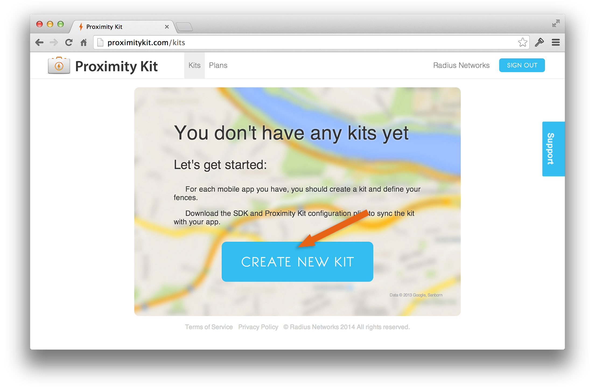
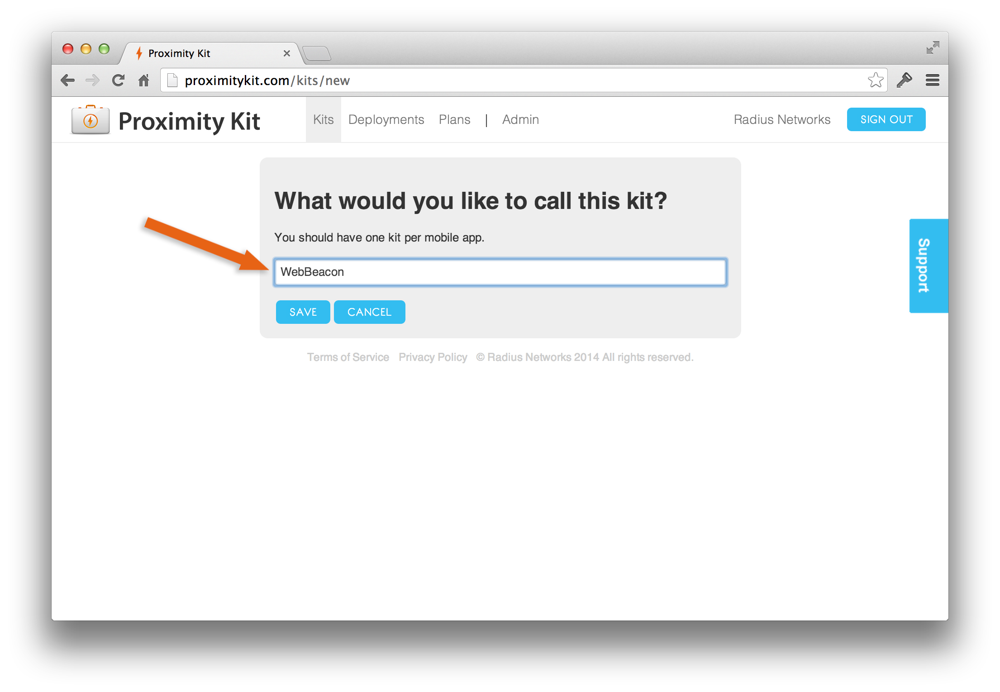
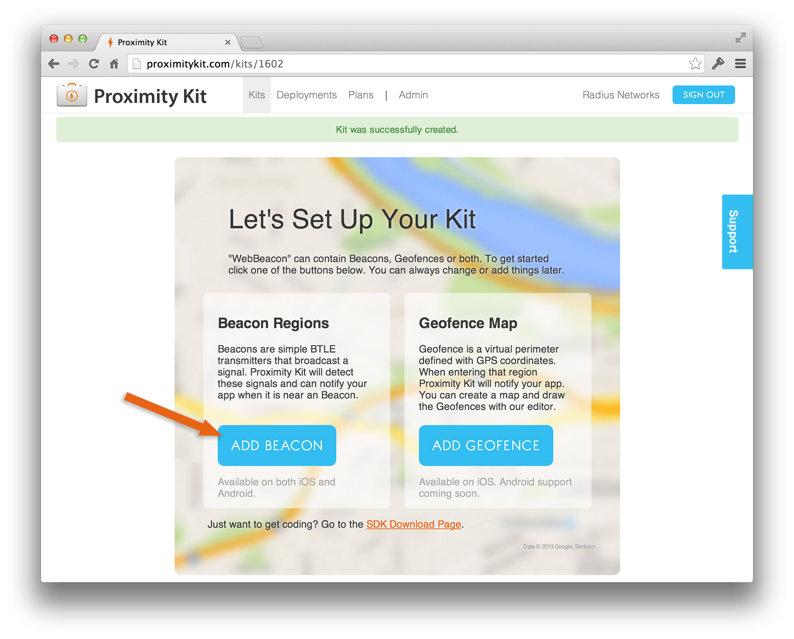
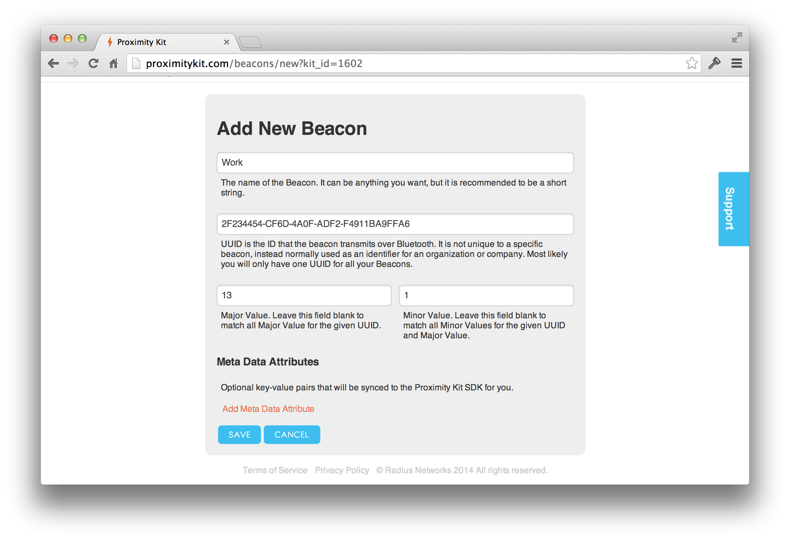
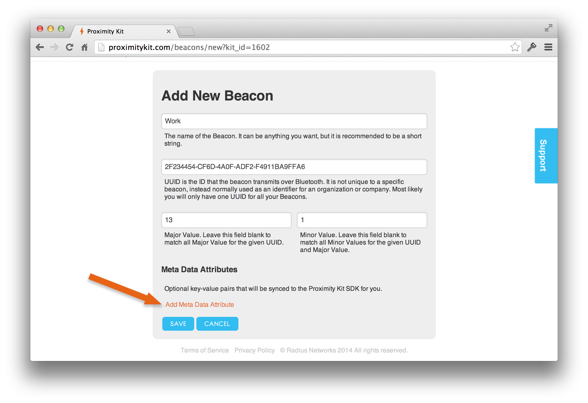
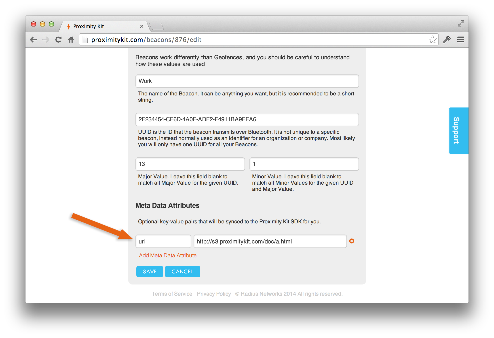
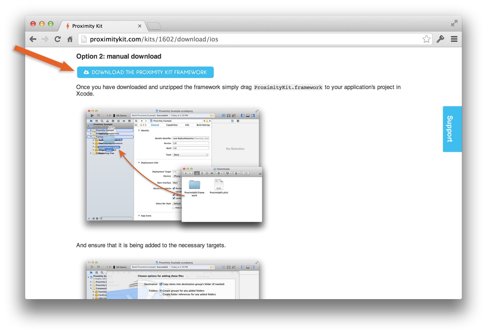
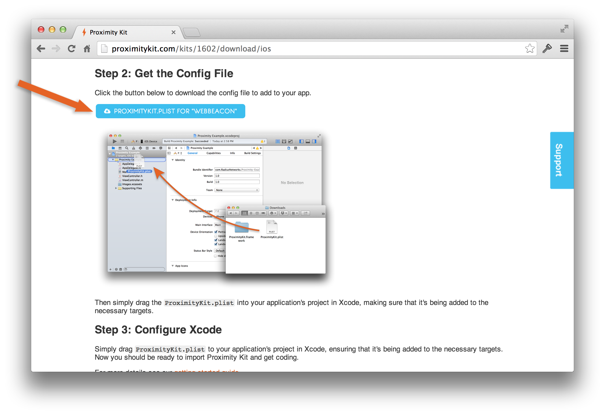
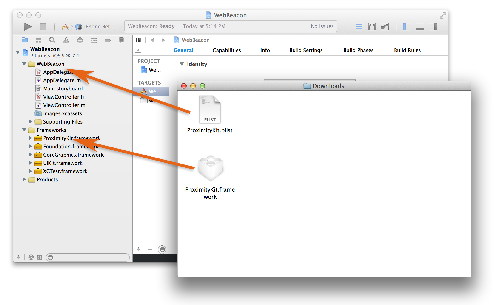
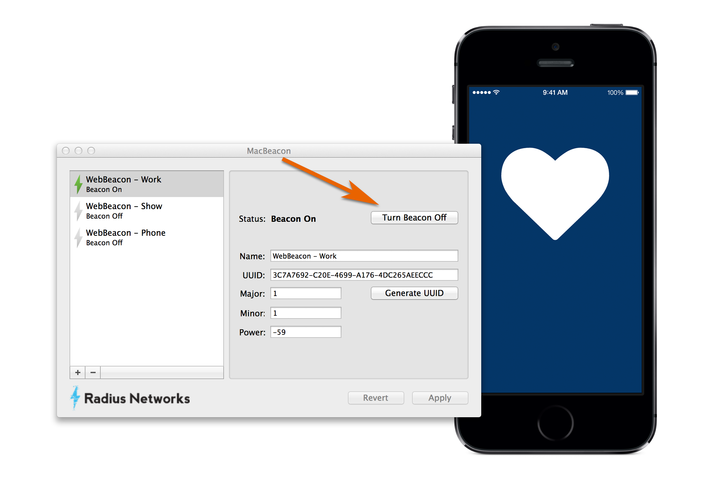

# Proximity Kit Tutorial

### Building a simple beacon app with Proximity Kit

Watch the video [here](http://youtu.be/Ux5R2vZBleI).

One common request with proximity kit is "How can have an app show the user something when they are near a beacon?"

Turns out this is fairly straightforward, there are a few steps. And you will be writing code, but Proximity Kit should handle the heavy lifting.

You will:

1. Create a Kit in the web interface
1. Make a new iOS app with Xcode
1. Add Proximity Kit SDK to that app
1. Wire up a UIWebView to show a different web page for each beacon

# Watch the Tutorial

<iframe width="800" height="450" src="//www.youtube.com/embed/Ux5R2vZBleI?rel=0" frameborder="0" allowfullscreen></iframe>

Or keep reading for a full details.

---

# Create a Kit

In the Proximity Kit ecosystem a Kit is 1:1 to an App. Since we are going to make a new app, lets add a kit. Click on [Kits](/kits); it's also at the very top of the page in the navigation header. If you don't have any you will see a page like this. Click that big "Create New Kit" button.



Now we set the name of the Kit/App. I used "WebBeacon".



Cool. Lets add some beacons. Click "Add Beacon".



I am going to add 3 beacons. One for Work, Home and a Theater. I want to use the following values for each:

| name    | uuid                                 | major | minor |
| ----    | ----                                 | ----- | ----- |
| Work    | 2F234454-CF6D-4A0F-ADF2-F4911BA9FFA6 | 13    | 1     |
| Home    | 2F234454-CF6D-4A0F-ADF2-F4911BA9FFA6 | 13    | 2     |
| Theater | 2F234454-CF6D-4A0F-ADF2-F4911BA9FFA6 | 13    | 3     |

But as I add them I am going to associate a bit a meta data with each. This is where the real power of Proximity Kit starts to peek through. We can associate and manage data on top of beacon identifiers and have it synced to the device for you.




For WebBeacon I want a URL associated with each beacon. So I will add the following to each beacon:

| name    | key  | value                                 |
| ----    | ---- | -----                                 |
| Work    | url  | http://s3.proximitykit.com/doc/a.html |
| Home    | url  | http://s3.proximitykit.com/doc/b.html |
| Theater | url  | http://s3.proximitykit.com/doc/c.html |

Click "Add Meta Data Attribute":



Then add a "url" attribute with "http://s3.proximitykit.com/doc/a.html"



Just repeat this process for the other two beacons, setting a different minor value and url for each.

Let's go ahead and download the framework and config file for Xcode.




# iOS App

## Create Single View Application

Open Xcode and:

1. Create a new iOS project using the "Single View Application" template
1. Drag `ProximityKit.framework` into the "Frameworks" folder in the Project Navigator. Make sure that "Copy items into group's folder" is checked.
1. Drag `ProximityKit.plist` into the "Frameworks" folder" Make sure that "Copy items into group's folder" is checked.



Cool. Now you have a skeleton Xcode project. It's a good idea to build at this point and make sure everything works.

## Import and create a PKManager

Open the `AppDelegate.h` and:

1. Import the ProximityKit header
1. Add the `PKManagerDelegate` protocol
1. Add a property to keep track of your instance of `PKManager`:

Your app delegate might look something like this:

```objective-c
#import <UIKit/UIKit.h>

// Import the PK Header:
#import <ProximityKit/ProximityKit.h>

// Add the PK Protocol:
@interface AppDelegate : UIResponder <UIApplicationDelegate, PKManagerDelegate>

@property (strong, nonatomic) UIWindow *window;

// Add a property for the PKManager:
@property (strong, nonatomic) PKManager *proximityKitManager;

@end
```

Open your `AppDelegate.m` and:

1. Create the `PKManager`
1. Implement the didEnter: callback


```objective-c
-(BOOL)          application:(UIApplication *)application
didFinishLaunchingWithOptions:(NSDictionary *)launchOptions
{
    self.proximityKitManager = [PKManager managerWithDelegate:self];
    [self.proximityKitManager start];
    return YES;
}

-(void)proximityKit:(PKManager *)manager didEnter:(PKRegion *)region {
    NSString *url = region.attributes[@"url"];
    if (url) {
        // Post a notification with the URL to open
        [[NSNotificationCenter defaultCenter]
	  postNotificationName:@"FoundBeaconWithURL"
	                object:self
	              userInfo:@{@"url":url}];
    }
}

```

### View Controller

In the viewcontroller add a `UIWebView` to the storyboard and wire it up to an outlet. Then in the controller listen for the the notification:

```objective-c
-(void)viewDidLoad
{
    [super viewDidLoad];
    [self setupNotification];
}

- (void)setupNotification
{
    NSNotificationCenter *center = [NSNotificationCenter defaultCenter];
    [center addObserverForName:@"FoundBeaconWithURL"
                        object:nil
                         queue:nil
                    usingBlock:^(NSNotification *notification)
    {
        NSURL *url = [NSURL URLWithString:notification.userInfo[@"url"]];
        NSURLRequest *requestObj = [NSURLRequest requestWithURL:url];
        [self.webView loadRequest:requestObj];

    }];
}
```

That's it. You should have an app that will respond to a beacon. Let's test it out.

The easiest thing to use is our [MacBeacon](http://www.radiusnetworks.com/macbeacon-app.html) or the [Locate for iOS](http://store.radiusnetworks.com/collections/all/products/locate-ibeacon-app).

Run your app on your phone (the simulator cannot detect beacons) then fire up MacBeacon.


After the app is running turn the beacon on and within a few seconds the web view will load the webpage that was associated with the beacon.

Any questions? Drop us a <a href="mailto:support@radiusnetworks.com">note</a>.
